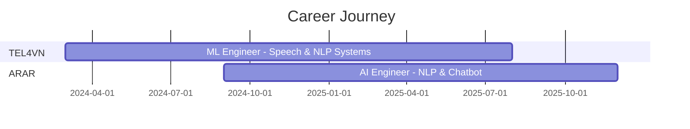

<div align="center">

#  Nguyễn Đình Thuần

[](https://git.io/typing-svg)


**`Digital Craftsman (ML Engineer / Backend Developer / Audio Alchemist)`**

[](https://www.linkedin.com/in/iamdinhthuan/)
[](mailto:Dinhthuan02022001@gmail.com)
[](https://github.com/iamdinhthuan)

</div>

---

##  About Me

```python
class ThuanNguyen:
    def __init__(self):
        self.name = "Nguyễn Đình Thuần"
        self.role = "Machine Learning Engineer"
        self.location = "Ho Chi Minh City, Vietnam 🇻🇳"
        self.education = "B.Eng Electronics & Telecommunications @ Ton Duc Thang University"
        
    def current_focus(self):
        return [
            "🎙️ Vietnamese Speech AI (TTS/STT)",
            "🧠 NLP & Large Language Models", 
            "🚀 Real-time AI Systems",
            "🔧 MLOps & Production Deployment"
        ]
    
    def philosophy(self):
        return "Bridging the gap between research papers and production systems"
```

> *"Tôi tin rằng AI tốt nhất là AI hoạt động ổn định trong thế giới thực, không chỉ trên benchmark."*

---

##  Research & Development Focus

<table>
<tr>
<td width="50%" valign="top">

### 🔊 Text-to-Speech Models Trained

| Model | Status |
|:------|:------:|
| VibeVoice TTS | ✅ |
| ZipVoice TTS | ✅ |
| NeuTTS Air | ✅ |
| Chatterbox TTS | ✅ |
| Piper TTS | ✅ |
| Orpheus TTS | ✅ |
| VITS TTS | ✅ |
| F5 TTS | ✅ |
| Stylish TTS | ✅ |
| Index TTS | ✅ |
| VoxCPM TTS | ✅ |
| StyleTTS 2 Lite | ✅ |
| Spark TTS | ✅ |
| xtts 2 | ✅ |

</td>
<td width="50%" valign="top">

### 🎧 Speech-to-Text Models Trained

| Model | Status |
|:------|:------:|
| Wav2Vec STT | ✅ |
| Conformer STT | ✅ |
| Zipformer STT | ✅ |
| Whisper STT | ✅ |

<br>

### 📊 Model Training Stats

```
┌─────────────────────────────┐
│  TTS Models Trained: 14     │
│  STT Models Trained: 4      │
│  Primary Language: 🇻🇳       │  
└─────────────────────────────┘
```

</td>
</tr>
</table>

---

##  Experience Timeline



### TEL4VN `Mar 2024 - Aug 2025`
**ML Engineer** — Phát triển hệ thống AI thoại và NLP tiếng Việt real-time
- FastAPI + Docker + GPU/CUDA infrastructure
- Production-grade speech processing pipelines

### ARAR `Sep 2024 - Present`
**AI Engineer** — Xây dựng chatbot SQL, RAG systems, và NLP solutions

---

## Tech Arsenal

<div align="center">

### Core Stack


### ML & NLP


### Infrastructure


</div>

---

## 📈 GitHub Analytics

<div align="center">
  
### 📊 Quick Stats
  


</div>

<div align="center">
  
  
</div>
---


## Let's Connect!

<div align="center">

| Platform | Contact |
|:--------:|:--------|
|  Email | [Dinhthuan02022001@gmail.com](mailto:Dinhthuan02022001@gmail.com) |
|  Phone | 0347 505 920 |
|  LinkedIn | [iamdinhthuan](https://www.linkedin.com/in/iamdinhthuan/) |
|  GitHub | [iamdinhthuan](https://github.com/iamdinhthuan) |

</div>


<div align="center">

**Thanks for visiting!** ⭐

*"Code is poetry, but deployed code is a symphony."*

</div>
